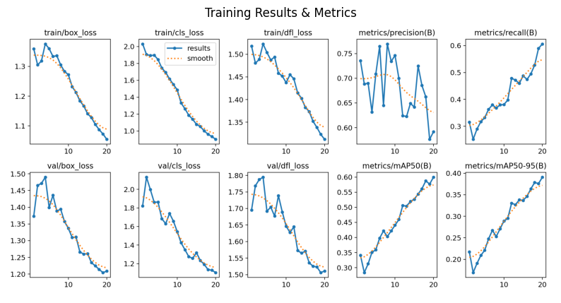
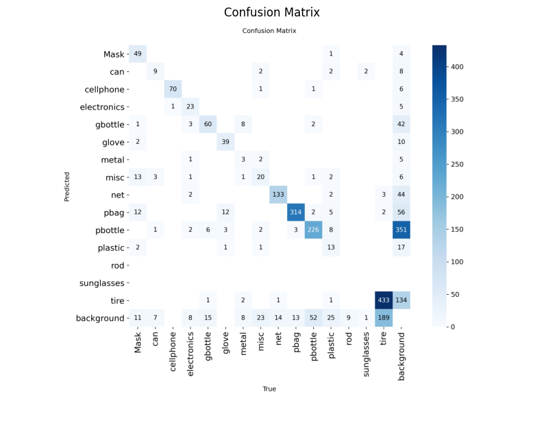

# MarineDebris-Net: Real-Time Underwater Trash Detection

An end-to-end Computer Vision pipeline to detect and localize 15 categories of marine pollutants. This project uses a **YOLOv8 (Nano)** architecture to achieve high-speed inference, making it suitable for deployment on autonomous underwater vehicles (AUVs).

## Performance Summary
* **Inference Speed:** 2.3ms (~434 FPS) on NVIDIA Tesla T4 GPU.
* **Total Latency:** 4.9ms per image (including pre/post-processing).
* **Global mAP@50:** 0.60 (60%).
* **Top Classes:** Cellphones (98.9%), Plastic Bags (95.4%), Fishing Nets (86.1%).

## Tech Stack
- **Framework:** Ultralytics YOLOv8
- **Language:** Python 3.12
- **Hardware:** NVIDIA Tesla T4 (Google Colab)
- **Libraries:** PyTorch, OpenCV, Matplotlib, YAML

## Results
Training was conducted over **20 epochs** with a **batch size of 16**, leveraging transfer learning from COCO-pretrained weights.

| Metric | Value |
| :--- | :--- |
| **Precision (P)** | 0.591 |
| **Recall (R)** | 0.606 |
| **mAP50** | 0.600 |
| **Inference Latency** | 2.3ms |

### Performance Analysis

## Key Insights
- **Class Imbalance:** The model excels at identifying bulky items (Tires, Bags) but requires more data for smaller categories like 'metal' and 'sunglasses'.
- **Real-Time Readiness:** With a throughput of **204 FPS** (total pipeline), the system is optimized for high-speed temporal tracking in live video streams.

## Repository Structure
- `Real_Time_Marine_Debris_Detection_and_Localization_using_YOLOv8.ipynb`: Full source code and training pipeline.
- `best.pt`: Trained model weights (15-class detection).
- `marine_pollution.yaml`: Dataset configuration and class mapping.
- `results.png` & `confusion_matrix.png`: Statistical proof of model performance.

